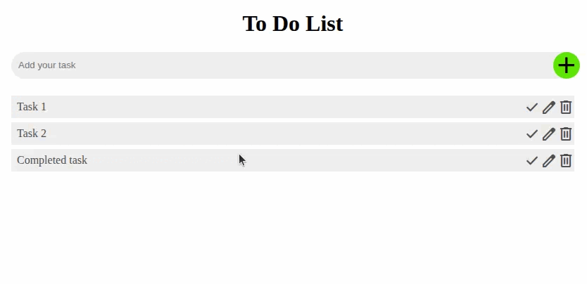

# To do app with React, FastAPI, and MongoDB

This is a little to do list app so I can practice React/TypeScript, FastAPI, and MongoDB. It started with a [project idea](https://cambridge-dev.com/program/317) from a [web dev meetup](https://www.meetup.com/boston-web-dev-class/) at the Cambridge, MA public library.

## How to develop/set up

Download this repo and

```bash
cd backend
python3 -m venv .venv
source .venv/bin/activate # or whichever variant you need
pip install -r requirements.txt
fastapi dev main.py

cd ../frontend
npm install
npm run dev
```
and open the link shown in your terminal.

If you're in VS Code you can do `Ctrl+Shift+P` and pick `Tasks: Run Task` then run the `dev and watch` task. That'll launch the fontend, backend, and a `tsc` watch in 3 tiled terminals.

* [index.html](./frontend/index.html) is the main HTML file
* [main.tsx](./frontend/src/main.tsx) is the main TS file
* [App.tsx](./frontend/src/App.tsx) is the root of the main logic
* [App.css](./frontend/src/App.css) is the main CSS
* [main.py](./backend/main.py) is the FastAPI backend
* [dbinterface.py](./backend/dbinterface.py) is the MongoDB interface

A live version (front-end only) is https://rlivings39.github.io/web-class/

## Managing the MongoDB database

```bash
# Run dev database
docker pull mongodb/mongodb-community-server:6.0.23-ubuntu2204
docker run --name mongodb_dev -d -p 27018:27017 mongodb/mongodb-community-server:6.0.23-ubuntu2204

mongosh --port 27018

# Run prod database
docker pull mongodb/mongodb-community-server:6.0.23-ubuntu2204
docker run --name mongodb -d -p 27017:27017 mongodb/mongodb-community-server:6.0.23-ubuntu2204

mongosh --port 27017
```

## Demo



## Backend

I'm working on the backend with FastAPI and currently going through their tutorial

https://fastapi.tiangolo.com/tutorial/path-params/#data-conversion

It's pretty slick with the integration with Pydantic. You pretty much declare your types and return what you want.

To set a status code declare a parameter on your route function of type `Response` and then edit that.

https://fullstackopen.com/en/part3/node_js_and_express

shows an end-to-end deployment.

To run backend tests:

```bash
cd backend
pytest
```

## Questions/feedback for next class

- Locally hosting Google icons
- React: using an object for state. Ok idiom? Am I doing it right?
  - Maria says to check out `useReducer`
- Show fetch and handling code. Is this the right order (i.e. await fetch, if success show)?
- Deploying front-end and backend?
- Containerization?
- Database?

## Actions
- [x] Add way to edit tasks
- [x] Convert input box into form
- [x] Look at TODOs in new code
- [x] Add a proper backend to store data
- [x] Add backend tests
- [x] How to set up a database
- [x] Update code to switch between prod and test db
- [x] Update test_main.py to test db mode too
- [x] Update code to allow switching from in memory mode to db mode from the outside
- [x] How to handle CORS securely
- [ ] How to containerize things
- [ ] Securely handle database in containerization setup
- [ ] Add database instructions to README
- [ ] Update backend tests to fail fast if MongoDB connection fails
- [ ] How to launch backend and frontend correctly
- [ ] Add frontend tests
- [ ] How to mock out backed when want to test frontend
- [ ] How to properly handle errors? Maybe add toast messages?
- [ ] Make sure focus and tab order are right
- [ ] Consider [Pydantic settings](https://docs.pydantic.dev/latest/concepts/pydantic_settings/#dotenv-env-support)
- [ ] Consider something like this [Pydantic interface for MongoDB ObjectId](https://www.mongodb.com/developer/languages/python/python-quickstart-fastapi/)
- [ ] Ensure type consistency between backend and frontend
