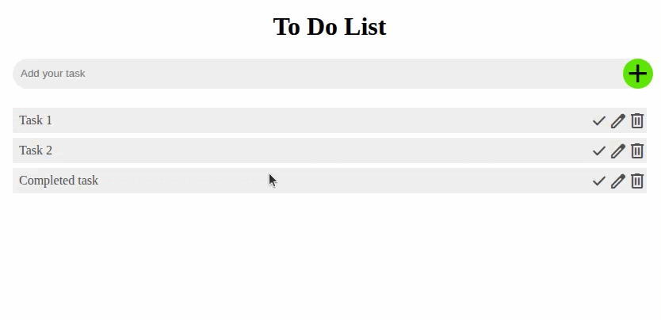

# To do app with React

This is a little to do list React app written in TypeScript.

## How to develop/set up

Download this repo and

```bash
cd web-class/todo-react-app
npm install
npm run dev
```

and open the link shown in your terminal.

* [index.html](./index.html) is the main HTML file
* [main.tsx](./src/main.tsx) is the main TS file
* [App.tsx](./src/App.tsx) is the root of the main logic
* [App.css](./src/App.css) is the main CSS

## Demo



## Actions
- [ ] Add way to edit tasks
- [x] Convert input box into form
- [ ] Make sure focus and tab order are right
- [ ] Add a proper backend to store data
